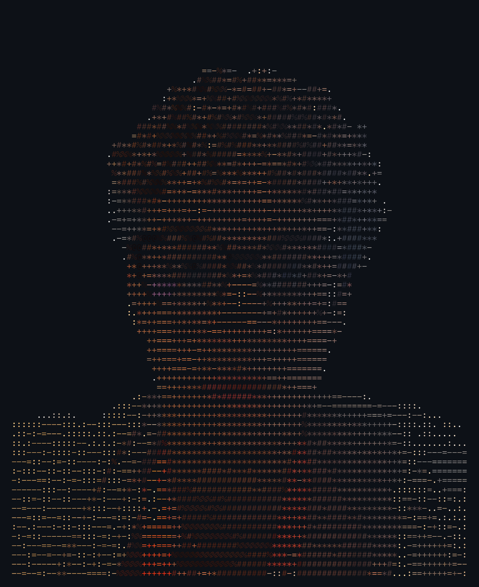

<h1 align="left">Hey 👋 What's up?</h1>

My name is Leandro Carvalho and I'm a <b>[sua profissão]</b>, from <b>[sua cidade]</b>.

<h2 align="left">About me</h2>

✨ Creating bugs since <b>[ano]</b> 
📚 I'm currently learning <b>[tecnologia]</b> 
🎯 Goals: <b>[seu objetivo]</b> 
🎲 Fun fact: <b>[fato curioso]</b>

<h2 align="left">I code with</h2>

  
  
  
  
  
  
  
  
  
  
  
  
  
  
  

<h2 align="left">Let's connect</h2>

  
  
  

